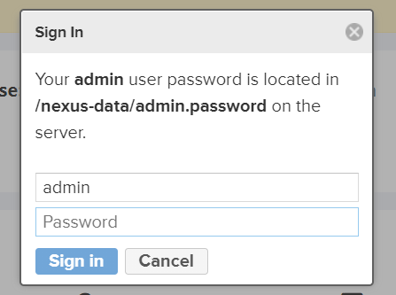
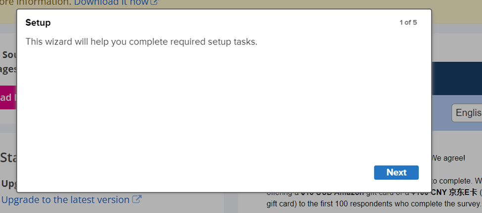
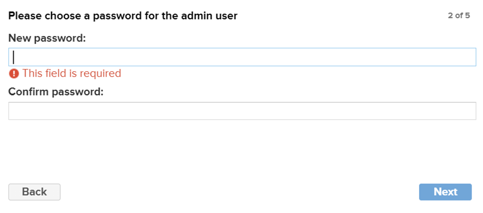
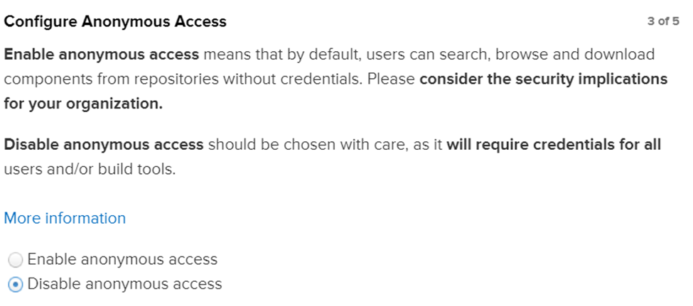
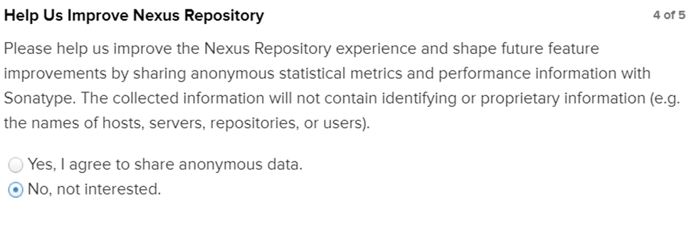
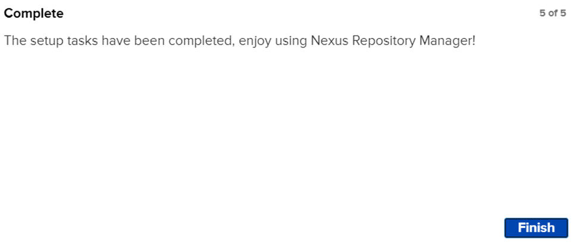

# Setup Sonatype Nexus (Container)

In this lab exercise, you are tasked by **Company A** to setup an Artifact repository application using Nexus v3.
Below are the following requirements:

* The application must only be accessed by the administrator and future users that will be included to access it.
* The application should be containerized and should be run using a container engine such as Docker.
* Only initial setup for the Nexus application is needed as other administrators will handle the setup of other components.
* A specific version of Nexus v3 is identified and it is **v3.34.0**.

# Steps
## Step 1 - Install Docker Engine Commercial Edition
Before the installation of the Docker Engine, it is required to setup GPG keys and the Docker package repository.

1. Add the official Docker GPG key
    ```
    curl -fsSL https://download.docker.com/linux/ubuntu/gpg | sudo gpg --dearmor -o /usr/share/keyrings/docker-archive-keyring.gpg
    ```

2. Add Docker's stable repository onto your package index using the command below.
    ```
    echo "deb [arch=$(dpkg --print-architecture) signed-by=/usr/share/keyrings/docker-archive-keyring.gpg] https://download.docker.com/linux/ubuntu $(lsb_release -cs) stable" | sudo tee /etc/apt/sources.list.d/docker.list > /dev/null
    ```

3. Update the `apt` package index and proceed with installing the Docker Engine, Docker CLI and containerd packages by copying the commands below.
    
    `sudo apt update`

    `sudo apt install -y docker-ce docker-ce-cli containerd.io`

4. Verify that docker is installed by running the `docker info` command. This will display system information of the Docker engine and your virtual machine as shown by the sample below.

    ```
    ...
    Supports d_type: true
    Native Overlay Diff: false
    userxattr: false
    Logging Driver: json-file
    Cgroup Driver: cgroupfs
    Cgroup Version: 1
    Plugins:
    Volume: local
    Network: bridge host ipvlan macvlan null overlay
    Log: awslogs fluentd gcplogs gelf journald json-file local logentries splunk syslog
    Swarm: inactive
    Runtimes: io.containerd.runc.v2 io.containerd.runtime.v1.linux runc
    Default Runtime: runc
    ...
    ```

## Step 2 - Docker Post-Installation
The steps below will allow us to run Docker without root privileges (sudo).

1. Create the `docker` group using the command below.

    `sudo groupadd docker`

2. Add your currently logged in user (i.e vmroot when using the training VMs) to the `docker` group using the command below.
    
    `sudo usermod -aG docker $USER`

3. Activate the docker group without closing the session by using the command below.
    
    `sudo newgrp docker`

## Step 3 - Install Sonatype Nexus 3
Now that the Docker Engine is installed, it is time to create the Nexus container instance.

Below are the steps to achieve this step.

1. Create the container volume to ensure that data from the Nexus container persists on the virtual machine even if the container instance is removed.

    `docker volume create --name nexus-data`

2. Validate that the container volume has been created by using the `docker volume ls` command.
    ```
    $ docker volume ls
    DRIVER    VOLUME NAME
    local     nexus-data
    ```

3. Inspect the local mountpoint path on the virtual machine by inspecting the container volume **nexus-data** using the command below.

    `docker volume inspect nexus-data`

    Output
    ```
    $ sudo docker volume inspect nexus-data
    [
        {
            "CreatedAt": "2021-10-17T11:50:21Z",
            "Driver": "local",
            "Labels": {},
            "Mountpoint": "/var/lib/docker/volumes/nexus-data/_data",
            "Name": "nexus-data",
            "Options": {},
            "Scope": "local"
        }
    ]
    ```

4. Create the Nexus container and mount it to the local container volume **nexus-data**.

    `docker run -d -p 8081:8081 --name nexus -v nexus-data:/nexus-data sonatype/nexus3:3.34.0`

    This will start downloading the Nexus 3 container image with tag **v3.34.0** into the Virtual Machine.
    Docker will also create a container named **nexus** exposing its container port 8081 to the system's port 8081.

5. Check if the Nexus container has been created and is running by using  `docker ps`.

    ```
    $ docker ps
    CONTAINER ID   IMAGE                    COMMAND                  CREATED              STATUS              PORTS                                       NAMES
    75160c63c38e   sonatype/nexus3:3.34.0   "sh -c ${SONATYPE_DI…"   About a minute ago   Up About a minute   0.0.0.0:8081->8081/tcp, :::8081->8081/tcp   nexus
    ```

    You can also check the container logs by using `docker logs -f nexus`. It should display log information of the initialization and startup of the Nexus application.

## Step 4 - Login to the Nexus Web UI

1. To obtain the initial admin password of Nexus, using **sudo**, display the entry contained within the file named **admin.password** which can be located on /nexus-data.

    Since /nexus-data is mounted on the local docker volume created, this can be accessed through **/var/lib/docker/volumes/nexus-data/_data**.

2. Copy the command below and paste it on your terminal to obtain the password.

    `sudo cat /var/lib/docker/volumes/nexus-data/_data/admin.password`

    Copy the password until the last letter after the vmroot user and save it on any secured credential tool or on a text editor for the meantime.

3. Copy the public IP address of your virtual machine and paste it on a text editor for safe keeping and take note of the Nexus application port which is **8081**.

    

4. Open any web-browser of choice and navigate to **http://<YOUR_VM_PUBLIC_IP>:8081/**. This should display the welcome page of the application. Click on **Sign-in** to proceed with accessing the application's web UI contents.

    

5. In the **Username** field, type in **admin** and on the **Password** filed, copy and paste the admin password. Click the **sign-in** button to continue.
   
   

    Once the credentials have been provided a new pop-up box will show for the initial setup.

## Step 4 - Initial Setup and new Admin Password
On the initial setup wizard box, click on **Next** to proceed with the setup of your application.



Step 2 is for the setup of a new admin password to replace the temporary one created and found on the **admin.password** file.

Provide your desired password using any password generator of choice, or type in whatever you think of.


Click on **Next** to proceed with step 3 of the setup wizard.

Save the new password on any secured storage, file or credentials storage software.

## Step 5 - Anonymous Access
Step 3, is for enabling and disabling anonymous access to the Nexus web UI.

Enabling anoynmous access if good if the goal of Nexus will be an artifact repository that should be accessible by anyone within the company, project and even by the public.

For this scenario, this should be set to **Disable anonymous access**. This is to prevent anyone from accessing the web UI and contents such as artifacts, obtaining repository URLs.



Once done, click **Next** to proceed with the next step.

## Step 6 - Sharing Anonymouse Data
Step 4, is for allowing Nexus to share anonymouse data to Sonatype.

Set this to **No, not interested** to ensure no data from the application will be sent.


Once done, click **Next** to proceed with the next step.

## Step 7 - Setup Completion
Step 5, is for the finalization of the setup.

Click on the **Finish** button to complete the Setup wizard.


## Wrap-up
You have now completed the setup of Docker Engine, the setup of the Sonatype Nexus v3 container, and the setup wizard.

To wrap-up this laboratory exercise, please ensure that the container is stopped before closing your VM web terminal.

Run the command below to stop the Nexus container created during the exercise.
`docker stop nexus`

Close the web browser tab of your VM web terminal to completely exit from the VM SSH session.

