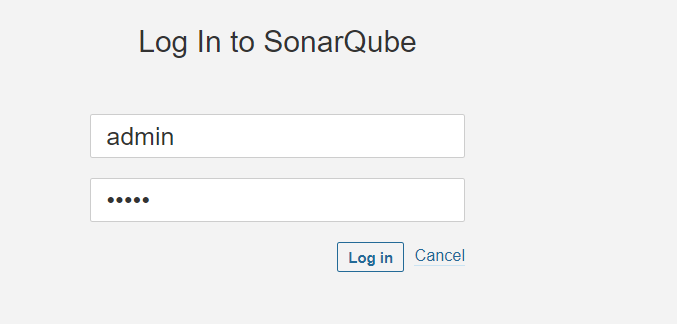
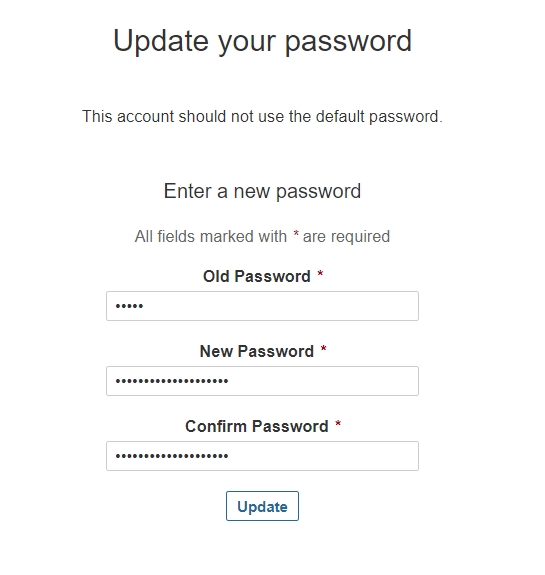

# Setup Sonarqube (Container)

In this lab exercise, you are tasked by **Company A** to setup the Sonarqube application to enable development teams to run static code quality analysis.

Below are the following requirements:

* The application should be containerized and should be run using a container engine such as Docker.
* Use Sonarqube's Community Edition (CE) as it is open source.
* Use Long Term Support (LTS) to ensure security updates and finalized and proven features are used.
  * Selected version is **8.9.2**
* The application's database should be hosted on PostgreSQL.
* Only initial setup for Sonarqube is needed as of the moment.


## Important Note
When you see a note which contains <span style="color:red">**Screenshot Checkpoint**</span>, please take a screenshot on completing the task(s) and save the file name as `git_lab_task_<STEP_NUMBER>_<EID>`.

Image can be **.png** or **.jpeg** format.
Upload the screenshots to the [Completed Lab Exercises](https://teams.microsoft.com/_#/files/General?threadId=19%3A4btfUNySeEkAxaKgSACQlxGcnuK_2JVxvUDdyHbxYps1%40thread.tacv2&ctx=channel&context=completed_lab_exercises&rootfolder=%252Fsites%252FIXDevSecOpsCapabilityBootcamp%252FShared%2520Documents%252FGeneral%252FCourse%252Fcompleted_lab_exercises) folder of the **IX DevSecOps Capability Bootcamp** channel.

# Steps
## Step 1 - Install Docker Engine Commercial Edition
Before the installation of the Docker Engine, it is required to setup GPG keys and the Docker package repository.

1. Add the official Docker GPG key
    ```
    curl -fsSL https://download.docker.com/linux/ubuntu/gpg | sudo gpg --dearmor -o /usr/share/keyrings/docker-archive-keyring.gpg
    ```

2. Add Docker's stable repository onto your package index using the command below.
    ```
    echo "deb [arch=$(dpkg --print-architecture) signed-by=/usr/share/keyrings/docker-archive-keyring.gpg] https://download.docker.com/linux/ubuntu $(lsb_release -cs) stable" | sudo tee /etc/apt/sources.list.d/docker.list > /dev/null
    ```

3. Update the `apt` package index and proceed with installing the Docker Engine, Docker CLI and containerd packages by copying the commands below.
    
    `sudo apt update`

    `sudo apt install -y docker-ce docker-ce-cli containerd.io`

4. Verify that docker is installed by running the `docker info` command. This will display system information of the Docker engine and your virtual machine as shown by the sample below.

    ```
    ...
    Supports d_type: true
    Native Overlay Diff: false
    userxattr: false
    Logging Driver: json-file
    Cgroup Driver: cgroupfs
    Cgroup Version: 1
    Plugins:
    Volume: local
    Network: bridge host ipvlan macvlan null overlay
    Log: awslogs fluentd gcplogs gelf journald json-file local logentries splunk syslog
    Swarm: inactive
    Runtimes: io.containerd.runc.v2 io.containerd.runtime.v1.linux runc
    Default Runtime: runc
    ...
    ```

## Step 2 - Docker Post-Installation
The steps below will allow us to run Docker without root privileges (sudo).

1. Create the `docker` group using the command below.

    `sudo groupadd docker`

2. Add your currently logged in user (i.e vmroot when using the training VMs) to the `docker` group using the command below.
    
    `sudo usermod -aG docker $USER`

3. Activate the docker group without closing the session by using the command below.
    
    `sudo newgrp docker`

<span style="color:red">**Screenshot Checkpoint**</span>

## Step 3 - Install docker-compose
The steps below will install docker-compose which will be used to create the Sonarqube and PostgreSQL service stack.

1. Download the docker-compose binary executable as root or sudo user. This will save the binary as docker-compose on `/usr/local/bin`.

    `sudo curl -L "https://github.com/docker/compose/releases/download/1.29.2/docker-compose-$(uname -s)-$(uname -m)" -o /usr/local/bin/docker-compose`

2. Change the `docker-compose` executable permisisons to execute (+x).
   
    `sudo chmod +x /usr/local/bin/docker-compose`

3. Create a symbolic link of `docker-compose` to `/usr/bin`.

    `sudo ln -s /usr/local/bin/docker-compose /usr/bin/docker-compose`

4. Validate if the setup was successful by running `docker-compose --version`.
    ```
    $ docker-compose --version
    docker-compose version 1.29.2, build 5becea4c
    ```
<span style="color:red">**Screenshot Checkpoint**</span>

## Step 4 - Configure Docker Host for Sonarqube
Sonarqube comes with Elasticsearch out-of-the-box, to ensure that Docker can run Elasticsearch and comply with its **production mode requirements** and **file descriptors configuration**, the following settings need to be configured as root.

```
sysctl -w vm.max_map_count=524288
sysctl -w fs.file-max=131072
ulimit -n 131072
ulimit -u 8192
```
<span style="color:red">**Screenshot Checkpoint**</span>

## Step 5 - Clone the lab repository
1. Change back to your user's home directory and clone the `ix-devops-ci-lab` repository.
   
    `cd ~ && git clone https://ixdevsecopsbootcamp@dev.azure.com/ixdevsecopsbootcamp/IX%20DevOps%20Bootcamp/_git/ix-devops-ci-lab`

    Provide your Personal Access Token (PAT) once requested by Git during cloning.

2. Change directory to `ix-devops-ci-lab/lab/sonar/` and run `docker-compose up -d`.

    `cd ix-devops-ci-lab/lab/sonar/ && docker-compose up -d`

    This will create the PostgresSQL and Sonarqube containers named sonar_sonardb_1 and sonar_sonarqube_1.

    

3. Check if the PostgreSQL and Sonarqube containers have been created successfully and are running using `docker ps`.
   
   ```
   $ docker ps
    CONTAINER ID   IMAGE                       COMMAND                  CREATED         STATUS         PORTS                                       NAMES
    7e8595e2f00e   postgres:13.4-alpine        "docker-entrypoint.s…"   9 minutes ago   Up 9 minutes   0.0.0.0:5432->5432/tcp, :::5432->5432/tcp   sonar_sonardb_1
    49debb3df7f9   sonarqube:8.9.2-community   "bin/run.sh bin/sona…"   9 minutes ago   Up 9 minutes   0.0.0.0:9000->9000/tcp, :::9000->9000/tcp   sonar_sonarqube
    _1
   ```
<span style="color:red">**Screenshot Checkpoint**</span>

## Step 6 - Access the Sonarqube UI
1. Copy the public IP address of your virtual machine and paste it on a text editor for safe keeping. Take note also of the Sonarqube application port which is **9000**.
   
   

2. Open any web-browser of choice and navigate to **http://<YOUR_VM_PUBLIC_IP>:9000/**.
   Type in username field **admin** and password **admin**.
   

<span style="color:red">**Screenshot Checkpoint**</span>

## Step 7 - Update the admin password
On login, you will be prompted to update your admin account's password.
Type in the old password which is **admin** and define a new password of your choosing.

Make sure to confirm the new password before clicking the **Update** button.
   


Once done, you will be sent to the main page of your SonarQube application.


<span style="color:red">**Screenshot Checkpoint**</span>

## Wrap-up
You have now completed the setup of Sonarqube using Docker Engine, and docker-compose to create the service stack and use postgreSQL to be the database.

To wrap-up this laboratory exercise, make sure that the containers are deleted before closing your VM web terminal.

`cd ~/ix-devops-ci-lab/lab/sonar/ && docker-compose down`

Close the web browser tab of your VM web terminal to completely exit from the VM SSH session.
